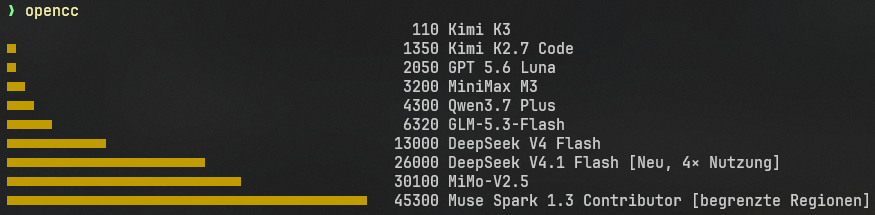

# opencc

Show the currently cheapest and recommended opencode models — right in your terminal, no browser needed. Fast and simple.



## What it does

Fetches the model allowance table from [opencode.ai/de/go](https://opencode.ai/de/go) and renders it as animated terminal bars: estimated requests per 5h, plus markers like `Neu`, `4× Nutzung`, or region hints.

## Install

```sh
cargo install --path .
```

## Usage

```sh
opencc
```
